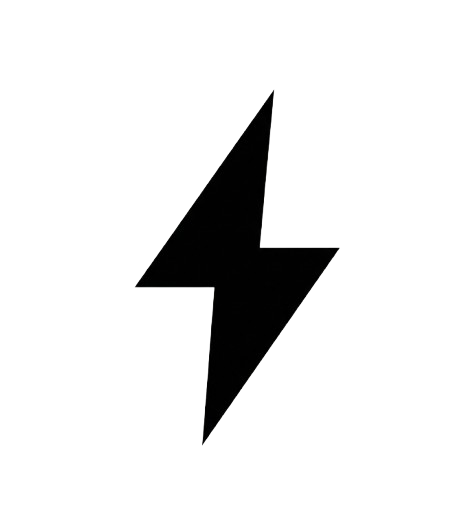
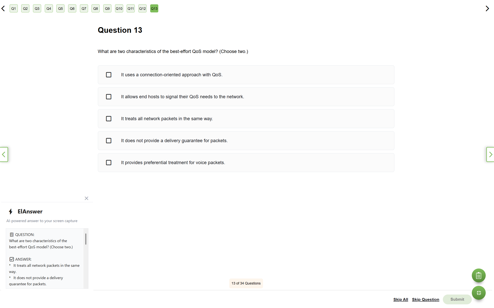
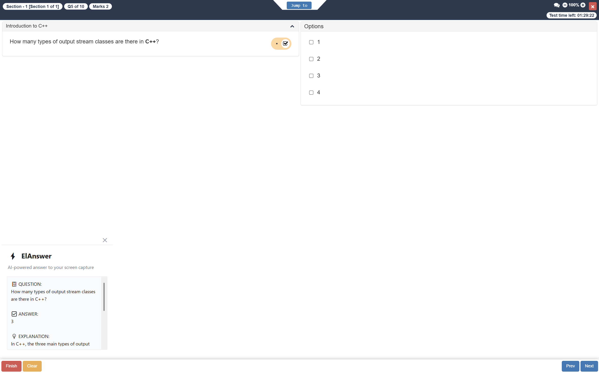

<p align="center">
  
</p>

<h1 align="center">⚡ ElAnswer</h1>

<p align="center">
  <strong>AI-powered screen capture tool that instantly solves questions, problems, and code snippets on your screen.</strong>
</p>

<p align="center">
  
  
  
  
</p>

---

## ✨ Features

- 🖥️ **Instant Screen Capture** - Press a hotkey to capture your entire screen
- 🤖 **AI-Powered Analysis** - Uses Google Gemini to analyze and solve problems
- 🎯 **Model Selection** - Choose from all available Gemini models via Settings
- 📋 **Smart Formatting** - Answers are organized with Question, Answer, and Explanation sections
- 🎨 **Modern UI** - Clean, professional popup with rounded corners and smooth animations
- 🌙 **Dark/Light Theme** - Toggle between dark and light modes with a hotkey
- ⚙️ **Settings Panel** - Configure model, theme, auto-copy, and more
- 📍 **Position Memory** - Popup remembers where you last placed it
- 📚 **History** - Access your recent captures and answers anytime
- 📥 **System Tray** - Runs minimized in system tray, no console window
- 👻 **Stealth Mode** - Window is hidden from screen recording, screen sharing, and proctoring software (Windows 10 2004+)
- 🛡️ **Capture Protection** - Uses Windows Display Affinity API to exclude from screenshots
- 📌 **Always on Top** - Answer popup stays visible above all windows
- 📝 **One-Click Copy** - Copy the entire answer to clipboard instantly
- 📋 **Auto-Copy** - Optionally auto-copy answers to clipboard
- ⌨️ **Keyboard Shortcuts** - Full hotkey support for quick access
- ⚡ **Loading Indicator** - Small blinking logo at bottom-left shows when AI is processing
- 👁️ **Quick Hide/Unhide** - Instantly toggle visibility of all UI elements with a hotkey
- 💾 **Persistent Settings** - Your preferences are saved automatically

## 🖼️ Screenshot

```
┌─────────────────────────────────────┐
│                              ×      │
│  ⚡ ElAnswer                        │
│  AI-powered answer to your screen   │
│  ┌─────────────────────────────┐   │
│  │ 📋 QUESTION:                │   │
│  │ [Identified question]       │   │
│  │                             │   │
│  │ ✅ ANSWER:                  │   │
│  │ [Direct answer]             │   │
│  │                             │   │
│  │ 💡 EXPLANATION:             │   │
│  │ [Why this is correct]       │   │
│  └─────────────────────────────┘   │
│  ● Response generated              │
│  [Copy] [Close]      ESC to close  │
└─────────────────────────────────────┘
```

<p align="center">
  
</p>

<p align="center">
  
</p>

## 🚀 Quick Start

### Prerequisites

- Python 3.10 or higher
- Windows 10/11 (Build 19041+ recommended for stealth mode)
- Google Gemini API Key ([Get one here](https://makersuite.google.com/app/apikey))

### Installation

1. **Clone the repository**
   ```bash
   git clone https://github.com/XploitGh0st/elanswer.git
   cd elanswer
   ```

2. **Install dependencies**
   ```bash
   pip install -r requirements.txt
   ```
   
   Or install manually:
   ```bash
   pip install google-generativeai keyboard pillow pystray pywin32
   ```

3. **Run the application**
   ```bash
   python main.py
   ```

4. **Configure your API key**
   
   On first run, the Settings panel will open automatically. Enter your Gemini API key:
   - Get your key from [Google AI Studio](https://makersuite.google.com/app/apikey)
   - Paste it in the "API Key" field
   - Click "Save Settings"
   
   Your API key is stored locally in `config.json` and never shared.

## ⌨️ Keyboard Shortcuts

| Shortcut | Action |
|----------|--------|
| `Ctrl + Alt + S` | Capture screen and get AI answer |
| `Ctrl + Alt + H` | View answer history |
| `Ctrl + Alt + P` | Open settings panel |
| `Ctrl + Alt + I` | Hide/Unhide UI (popup & loading indicator) |
| `Ctrl + Alt + T` | Toggle dark/light theme |
| `Ctrl + Alt + Q` | Quit the application |
| `ESC` | Close the answer popup |

## 📥 System Tray

ElAnswer runs minimized in your system tray (notification area). Right-click the tray icon to:

- **Capture Screen** - Trigger a screen capture (or double-click the icon)
- **Recent Answers** - Quick access to your last 5 answers
- **View History** - Open the full history popup
- **Dark Mode** - Toggle between dark and light themes
- **Hide/Show UI** - Toggle visibility of popup windows
- **Settings** - Open the settings panel
- **Quit** - Exit the application

## 🎯 Use Cases

- 📚 **Online Quizzes** - Get instant answers to multiple choice questions
- 💻 **Coding Problems** - Solve programming challenges and debug code
- 📖 **Homework Help** - Understand and solve academic problems
- 🔧 **Technical Questions** - Get explanations for technical concepts
- 🧮 **Math Problems** - Solve equations and mathematical expressions

## 🛠️ Configuration

You can customize the hotkeys in `main.py`:

```python
# The Hotkey combination to trigger the capture
HOTKEY = "ctrl+alt+s"

# The Hotkey combination to quit the application
QUIT_HOTKEY = "ctrl+alt+q"

# The Hotkey combination to hide/unhide the popup
HIDE_HOTKEY = "ctrl+alt+i"

# The Hotkey combination to toggle theme (dark/light)
THEME_HOTKEY = "ctrl+alt+t"

# The Hotkey combination to show history
HISTORY_HOTKEY = "ctrl+alt+h"

# The Hotkey combination to open settings
SETTINGS_HOTKEY = "ctrl+alt+p"

# Maximum number of history items to keep
MAX_HISTORY_ITEMS = 10
```

### Persistent Settings

ElAnswer automatically saves your preferences to `config.json`:

- **AI Model** - Your selected Gemini model
- **Popup Position** - Drag the popup anywhere and it will remember the location
- **Theme Preference** - Your dark/light mode choice is saved automatically
- **Auto-Copy** - Option to automatically copy answers to clipboard
- **Show Explanations** - Toggle detailed explanations in answers
- **Compact Mode** - Use smaller popup windows
- **History Limit** - Configure maximum number of history items

### Settings Panel

Open Settings with `Ctrl + Alt + ,` or from the system tray to configure:

- **API Key** - Configure your Gemini API key
- **AI Model** - Select from all available Gemini models (fetched from API)
- **Appearance** - Switch between Light and Dark themes
- **Stealth Mode** - Hide window from screen recording/sharing software (Windows 10 2004+)
- **Options** - Toggle auto-copy, explanations, and compact mode
- **History Limit** - Set how many recent answers to keep (5-50)

### Answer History

Your recent answers are saved to `history.json`:

- Stores up to 10 recent answers (configurable via `MAX_HISTORY_ITEMS`)
- Access via `Ctrl + Alt + H` or system tray menu
- Click any history item to view the full answer
- Clear history anytime from the history popup

## 📁 Project Structure

```
elanswer/
├── main.py          # Main application file
├── config.json      # User preferences (auto-generated)
├── history.json     # Answer history (auto-generated)
├── README.md        # This file
├── requirements.txt # Python dependencies
├── LICENSE          # MIT License
├── build.ps1        # Windows build script (PowerShell)
├── build.bat        # Windows build script (Batch)
├── ElAnswer.spec    # PyInstaller configuration
└── assets/
    ├── logo.png     # Application logo
    └── logo.ico     # Windows icon
```

## 🔨 Building Executable

```powershell
# Using PowerShell script
.\build.ps1

# Or using batch script
.\build.bat
```

The executable will be created at `dist/ElAnswer.exe`.

## 🔒 Privacy & Security

- **Local Processing** - Screenshots are captured locally and sent directly to Google's Gemini API
- **No Storage** - Images are not stored or saved anywhere
- **Stealth Mode** - Uses Windows Display Affinity API (`WDA_EXCLUDEFROMCAPTURE`) to hide the window from:
  - Screen sharing (Google Meet, Zoom, Teams, etc.)
  - Screen recording software
  - Proctoring software (PearsonVUE, etc.)
  - Screenshot tools
- **Platform Support** - Stealth mode requires Windows 10 version 2004+ (Build 19041+). On older Windows, windows function normally but aren't hidden from capture.

## ⚠️ Disclaimer

This tool is intended for educational purposes and personal use. Please use responsibly and in accordance with your institution's academic integrity policies.

## 🤝 Contributing

Contributions are welcome! Feel free to:

1. Fork the repository
2. Create a feature branch (`git checkout -b feature/amazing-feature`)
3. Commit your changes (`git commit -m 'Add amazing feature'`)
4. Push to the branch (`git push origin feature/amazing-feature`)
5. Open a Pull Request

## 📄 License

This project is licensed under the MIT License - see the [LICENSE](LICENSE) file for details.

## 🙏 Acknowledgments

- [Google Gemini](https://deepmind.google/technologies/gemini/) - AI model for image analysis
- [Python Keyboard](https://github.com/boppreh/keyboard) - Global hotkey detection
- [Pillow](https://python-pillow.org/) - Screen capture functionality
- [pystray](https://github.com/moses-palmer/pystray) - System tray icon support

---

<p align="center">
  Made with ❤️ by <a href="https://github.com/XploitGh0st">Nanda Kumaran G</a> & <a href="https://github.com/Saffronzen005">Saffron Zen</a>
</p>
